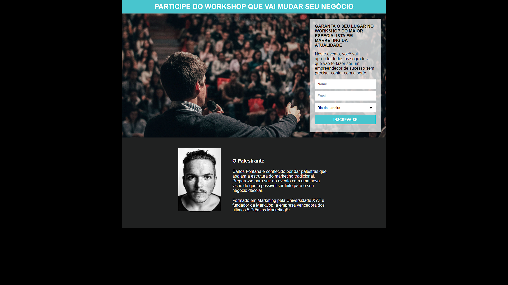

<h1 align="center"> Página de captura </h1>

Projeto realizado pelo curso programador BR  

  <a href="#-tecnologias">Tecnologias</a>&nbsp;&nbsp;&nbsp;|&nbsp;&nbsp;&nbsp;
  <a href="#-projeto">Projeto</a>&nbsp;&nbsp;&nbsp;|&nbsp;&nbsp;&nbsp;
  <a href="#-layout">Desafio</a>&nbsp;&nbsp;&nbsp;|&nbsp;&nbsp;&nbsp;
  <a href="#memo-licença">Licença</a>

  

 

  

## 🚀 Tecnologias

Esse projeto foi desenvolvido com as seguintes tecnologias:

- HTML e CSS
- Git e Github
- Mailchimp

## 💻 Projeto

Página de captura

## 🔖 Desafio

Recriar uma página visando captura de e-mails.

## :memo: Licença

Esse projeto está sob a licença MIT.

---
